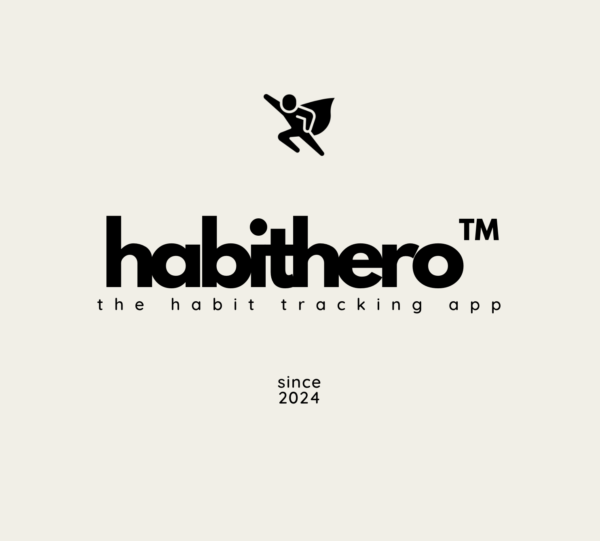
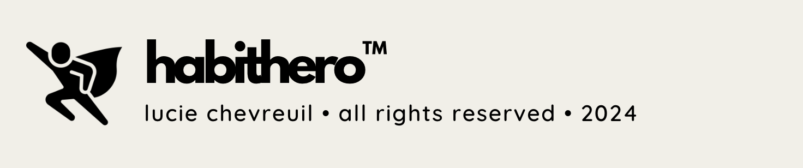

# HabitHero™

_Unleash Your Inner Hero, One Habit at a Time_

<hr>

Unleash your potential with **HabitHero™**, the ultimate habit tracking app designed to turn everyday tasks into epic wins! Log your daily habits, track your progress, and earn rewards like streak badges and points for staying consistent and smashing your goals. Whether you're building a new routine or mastering a healthy habit, HabitHero™ keeps you motivated with a powerful scoring system and real-time progress updates. Level up your life by conquering milestones and unlocking achievements—your journey to becoming a habit hero starts today!

<hr>



<hr>

### About the App

This is a fullstack application with a frontend built with React and Next.js for UI and server-side rendering, styled with TailwindCSS, uses TypeScript for type safety, runs Jest for unit testing, and integrates Apollo GraphQL for data management. The backend of this application uses Prisma for database ORM, SQLite as the database, and GraphQL for managing API queries and mutations.

Current functionality includes a retractable sidebar, page routing, email subscription form with frontend data validation, saving a "Player" object to the database, unit testing, and displaying saved email addresses from the database in the frontend.

<hr>

### Technologies

Frontend 🎨


Backend 📊


<hr>

### Getting Started

Terminal 1

```
cd server
node src/index.js
```

Terminal 2

```
cd frontend
npm run dev
```

<hr>

### Feedback

Initial repository for the backend had package compatibility issues which made it difficult to jumpstart the application. The backend was rebuilt with the spirit of the initial repository, including layout and technologies. This made it easier to use updated packages and ensure compatibility.

<hr>

### Folder Structure

.
├── frontend
│   ├── src                # Holds frontend application
│        ├── components    # UI Components
│        └── app           # Holds frontend application
|             ├── about    # Nextjs Route to `/about`
|             ├── assets   # Folder of images
|             ├── contact  # Nextjs Route to `/contact`
|             └── utils    # Utils and Jest tests
|
├── server
│   ├── prisma             # Database and schema
│   ├── src                # GraphQL resolvers and Apollo Server

<hr>

### Testing

The frontend library has Jest unit testing. There is currently an issue with conflicting babel configurations. In order to run Jest tests, create a file `babel.config.js` in the `src` folder. Run the following command to see the test. Delete `babel.config.js` to run regular application.

```
module.exports = {
  presets: ["@babel/preset-env"],
};
```

Run Jest test with this command:
```
npm test
```

<hr>


### Frontend Exercise

```
TIMEBOX:    2-3 hours max. We mean it!
LANGUAGES:  Javascript/Typescript
FRAMEWORKS: React and any libraries you want
TESTS:      nice to have, but not mandatory
DOCS:       nice to have, but not mandatory
```

Implement the following design in the Figma file using [React](https://reactjs.org/) consuming the API. Feel free to implement using any techniques you feel are appropriate.

- [Design File](https://www.figma.com/file/wuTVYU1iqFg8Mjkgr170jz/Takehome?node-id=0%3A1)

- [Prototype](https://www.figma.com/proto/wuTVYU1iqFg8Mjkgr170jz/Takehome?page-id=0%3A1&node-id=1%3A1192&viewport=241%2C48%2C0.55&scaling=min-zoom&starting-point-node-id=1%3A1192)

<hr>

### Backend Exercise

```
TIMEBOX:    2-4 hours max. We mean it! Set at timer and hard-stop at 4 hours ⏱
LANGUAGES:  Typescript
FRAMEWORKS: Express, Apollo, NodeJS, etc
TESTS:      nice to have, but not mandatory
DOCS:       nice to have, but not mandatory
```

Create a public GraphQL API using [Apollo Server](https://www.apollographql.com/docs/apollo-server/) and [Prisma](https://www.prisma.io/).

In the backend folder you will find a NodeJS project preconfigured with database models using [Prisma](https://www.prisma.io/) as an ORM.

`./backend/db/prisma/schema.prisma`

The database models consist of a:

- [Player] A record for a user that has signed up
- [Action] A type of "action" a player can perform
- [Reward] A reward granted to user for performing specific actions
- [ActionRequirement] The action(s) required for a reward to be granted
- [PlayerAction] A record of actions the player has performed
- [PlayerReward] A record of rewards the player has been granted

Run the seed file to populate the database.

`npm run prisma:seed`

#### The task:

- Create a `Mutation` for signing up a `Player` by `email`.
- Create a `Query` for returning the fields required by the application for `Player` by `email`.
- The player should return an additional `score` field which is the cumulative score of their rewards

What a user signs up the following should happen:

- A `Player` is created
- Record a `PlayerAction` that the player has performed the `PLAYER_SIGNUP` action
- Determine if the `Player` can be granted any rewards based on the action and create a `PlayerReward` record

<hr>



<hr>

Source Inc 🚀 Lucie Chevreuil 👩‍💻 Tuesday, October 1st 🎃
