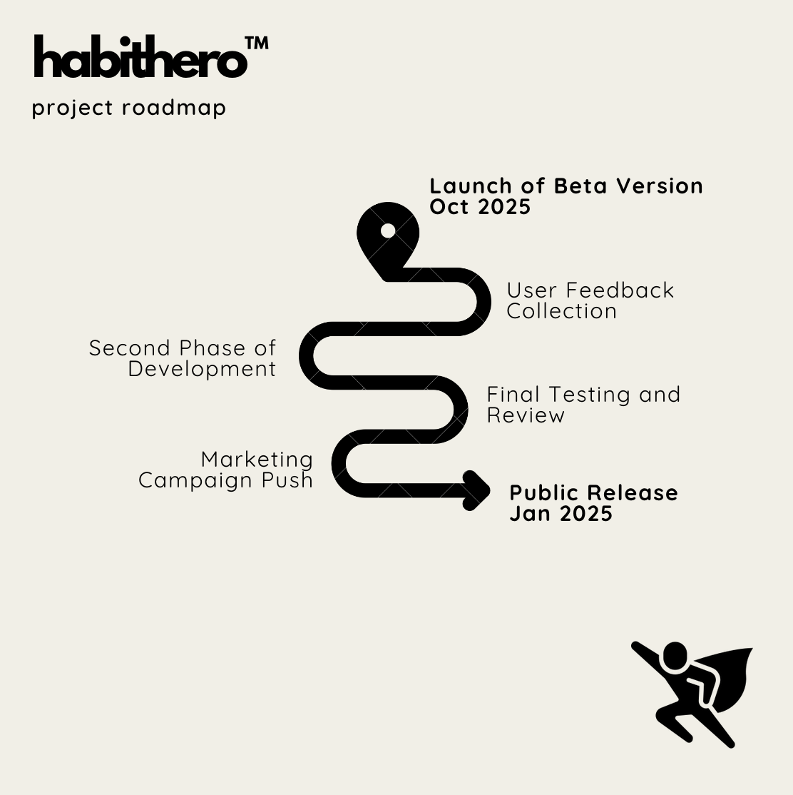

# HabitHero™

_Unleash Your Inner Hero, One Habit at a Time_

### 🚀 Project Roadmap

Our HabitHero™ project is divided into several milestones to ensure we stay on track and deliver a high-quality habit-tracking app. Below is an outline of our progress and future goals, as we build a powerful tool for users to track, maintain, and be rewarded for their daily habits.

### Nice to Haves
In the future, I would like to tackle this list of functionality for the project:
- [ ] Server Side Rendering optimization on the frontend
- [ ] Refactor reusable components such as `<Button/>` to external Storybook UI-Library
- [ ] Visual regression testing for UI-Library
- [ ] Implement additional Objects in the backend such as `Referral`, `Action`, `PlayerAction`, `Reward`, `PlayerReward`,`ActionRequirement`
- [ ] Create database relationships, such as one:many (`Player`:`PlayerAction`) and one:one (`Player`:`Player` via a `Referral`)
- [ ] Create additional frontend pages to track habits, earn rewards, refer other Players
- [ ] Light mode + Dark mode and other frontend accessibility features
- [ ] Automatic build pipeline and `main` and `dev` branches with protections in Github
- [ ] Deploy application to Vercel

## 📅 Timeline

| Milestone                   | Start Date  | End Date    | Status         | Notes                                                        |
| --------------------------- | ----------- | ----------- | -------------- | ------------------------------------------------------------ |
| **Phase 1**: Planning       | Sep 27 2024 | Sep 28 2024 | ✅ Completed   | Requirements gathering, brainstorming, and project planning. |
| **Phase 2**: Development    | Sep 28 2024 | Sep 30 2024 | ✅ Completed   | Developing core features, setting up infrastructure.         |
| **Phase 4**: Testing        | Sep 30 2024 | Oct 1 2024  | ✅ Completed   | QA testing, bug fixes, and refinements.                      |
| **Phase 5**: Launch of Beta | Oct 1 2024  |             | 🚧 In Progress | Launch of beta version and user testing.                     |

## 📝 Release Notes

| Version  | Release Date | Highlights                                                             |
| -------- | ------------ | ---------------------------------------------------------------------- |
| **v1.0** | Oct 1 2024   | 🎉 Beta release with partial functionality including email sign-up. |
| **v0.9** | Sep 30 2024  | ✨ Internal release for testing.                                  |

Stay tuned for updates! 😊
